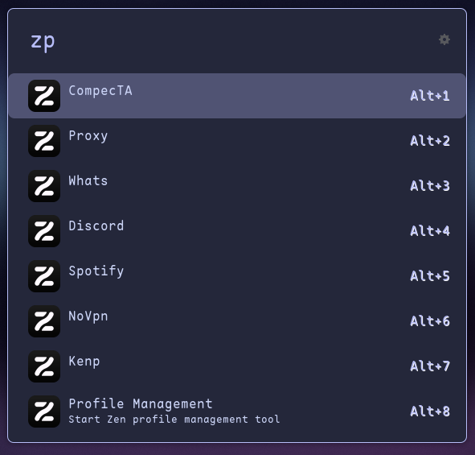

# Ulauncher Zen Profiles
An [Ulauncher](https://ulauncher.io) extension to open Zen with a user profile.
> Inspired by [Ulaucher Firefox Profiles Extension](https://github.com/kleber-swf/ulauncher-firefox-profiles)

## Screenshot 

## Install
1. Open Ulauncher preferences
2. Enter "Extensions" Tab
3. Click "Add extension" on the left
4. Paste the url: `https://github.com/kenanpelit/ulauncher-zen-profiles`
5. Press "Add"

## Dependencies
You need to create the profiles first inside the `about:profiles` page in Zen. Just enter this url in the address bar and manage your profiles.
Here is a more detailed version on the [Zen official support page](https://support.zen.com/en-US/kb/profile-manager-create-remove-switch-zen-profiles)

## Configuration
- **Zen Profile Keyword**: The keyword to activate the extension. Default: `zp`.
- **Zen Configuration Folder**: Zen profiles folder. You can find it inside the *"about:profiles"* page. Default: `~/.zen`
- **Zen Executable**: The command line to start Zen. Usually *"zen"*. Default: `zen`.

---
Preview Theme: [Orchis Dark](https://github.com/kleber-swf/orchis-dark-ulauncher)

